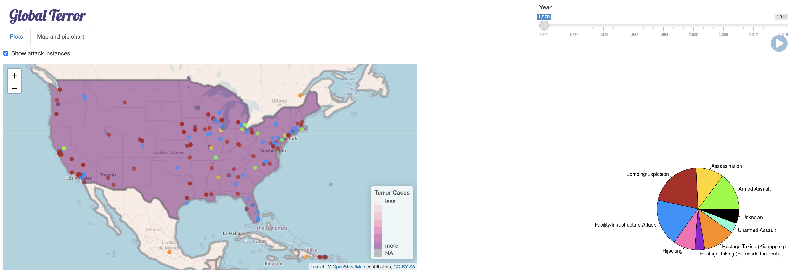
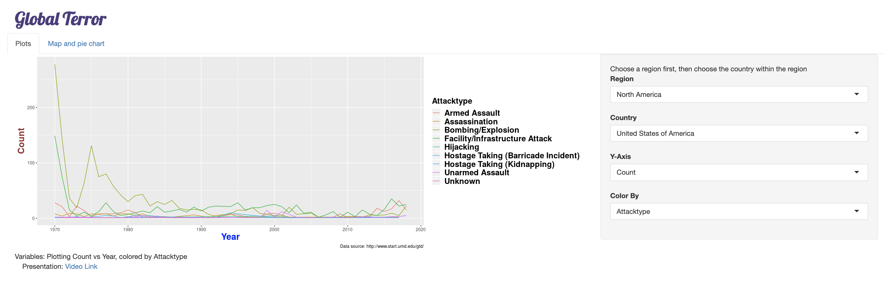

# Global Terrorism Interactive Visualization

## Introduction
In this project, we built a shinyapp in R to visualize the counts, types, locations, and trends of global terrorism in the past five decades. We focused on the region distribution of American terrorism and its trends over years. 

Authors: Huandong Chang, Yi Qin, and Vidush Goswami

## Presentation
we have our presentation on [Youtube](https://www.youtube.com/watch?v=R8nh2km174Q).

## Code
See 'app.R'. Since the app has already been deployed, it is easier to access the app [here](https://huandongchang.shinyapps.io/GlobalTerrorism/,target="_blank").

## Demo
In "Map and pie chart" tab, you can see the proportion of each attack type and each country's terrorism cases for each year. At the same time, you can see the location and attack type of each instance. 

Since the "Map and pie chart" tab can only give an overview and does not target a specific country, we also created the "Plots" tab. You can focus on one specific country and see its changes over years.

## Reference
Dataset Source: https://start.umd.edu/gtd/
